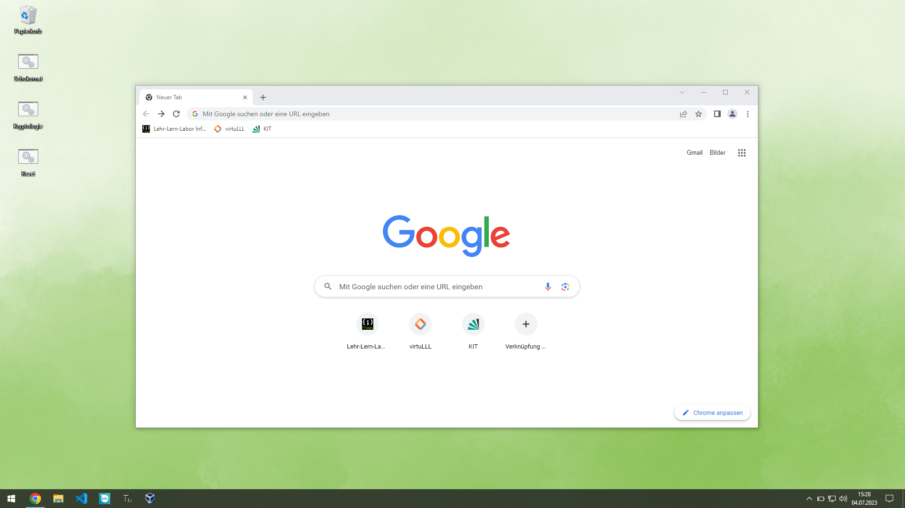
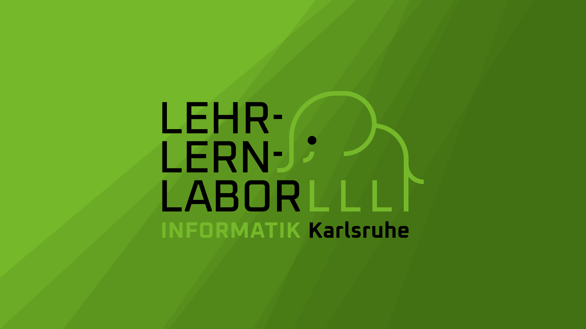

# Allgemeines
* Nutzer: `Lehr-Lern-LaborX` (X = Zahl auf Rechner)
* Passwort: `Informatik` (**unbegrenzt**)
* Internetzugriff **via KIT-WLAN**
* Ruhezustand im Energiemenü anzeigen
* Bildschirm im Netzbetrieb nie ausschalten
* Anzeigeeinstellungen > Skalierung auf 100%
* Taskleiste (farblich passend)
  * Neuigkeiten und Interessante Themen: Ausschalten
  * Suchen: Ausgblendet
  * Taskansicht-Schaltfläche nicht anzeigen
  * Programme anheften (alle anderen entfernen)
    * Chrome
    * Datei-Explorer
    * Visual Studio Code
    * Sphero-Edu
    * Thonny
    * Virtual Box
* Lesezeichen (Chrome)
  * Lehr-Lern-Labor Informatik (https://lehr-lern-labor.info)
  * virtuLLL (https://lehr-lern-labor.info/virtuLLL)
  * KIT (https://www.kit.edu/)
* Beispielkonfiguration: Desktop_example.png 
* Bildschirmhintergrund: Background.png 
* Sperrbilschirm: Homescreen.png 

# Software
* Git
* Java (JRE)
* Google Chrome (**Standardbrowser**)
* MS Office
* Visual Studio Code
* Sphero Edu (https://www.microsoft.com/p/sphero-edu/9n2796r62xlz)
  * *Wahl bei erstem Start umgehen (schulischer Nutzer > programmieren)*
  * *Erzeugte Programme bei Reset (s.u.) löschen*
  * *Standardprogramme hinterlegen*
* Thonny (https://thonny.org/)
* *OneDrive deaktivieren*


# Skripte auf Desktop
* Projektordner von GitHub: if(!exist) clone else pull
  * *Token/SSH-Key hinterlegen, um private Repos klonen zu können*
* Reset: Projektordner auf Desktop löschen, Downloads löschen, *Sphero-Programme zurücksetzen*, *Passwort-Schutz: LLL*, *Papierkorb leeren*

# ~VM für~ Science Camp KI
* keine VM, direkt in Windows
* Python 3.11
* virtuelle Umgebung für SCKI, s. [requirements.txt](requirements.txt)
* angepasstes Skript auf dem Desktop (current-Branch aus SCKI-Repo klonen und marimo-Notebook starten)

``` bash
# Beispielhafte Installation der Python-Umgebung
python -m venv scki
source scki\bin\activate
pip install -r requirements.txt
marimo edit
```

``` bash
#!/bin/bash
if [ ! -d "SCKI" ]; then
	git clone -b current --single-branch https://github.com/Lehr-Lern-Labor/SCKI.git SCKI
fi
cd SCKI
if git pull; then
    source scki\bin\activate
    marimo edit
    echo "Drücke eine Taste, um das Terminal zu beenden..."
    read -s -n 1
else
    echo ""
    echo "**************************************************"
    echo "  Fehler bei git pull - Bitte jemanden um Hilfe!"
    echo "**************************************************"
    echo ""
    $SHELL
fi
```
